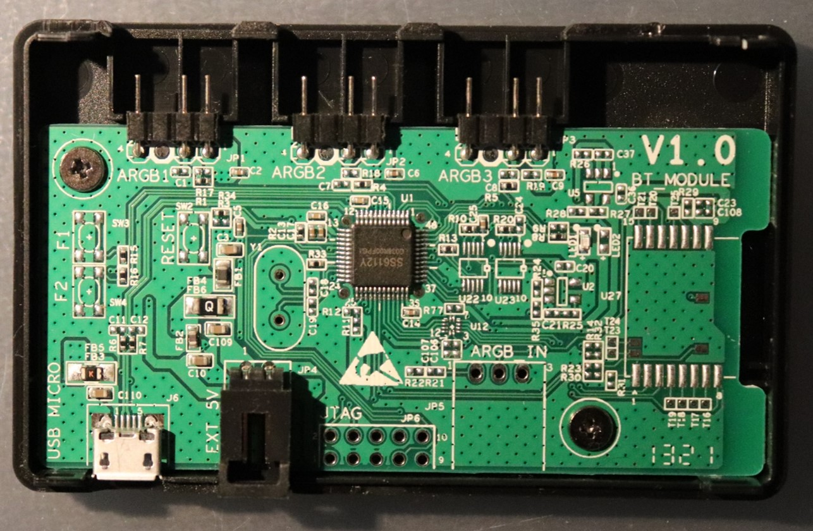
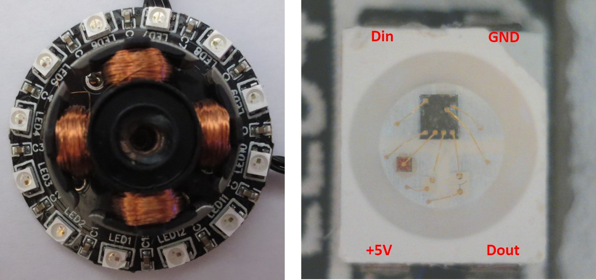
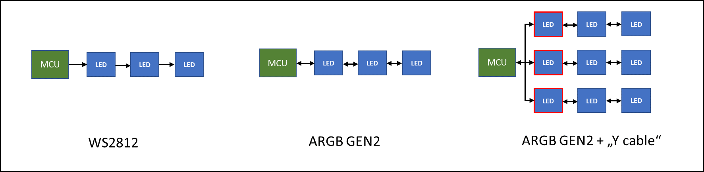
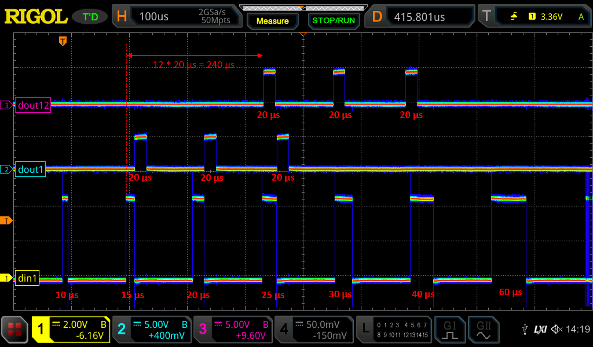
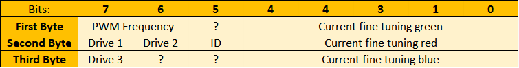
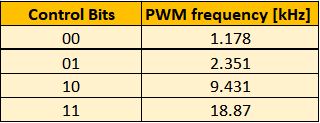
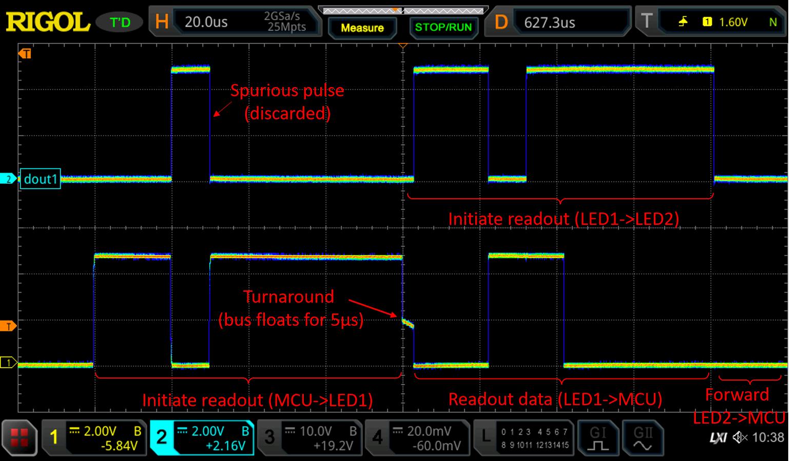
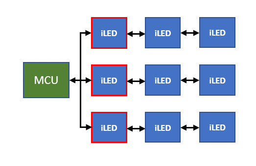
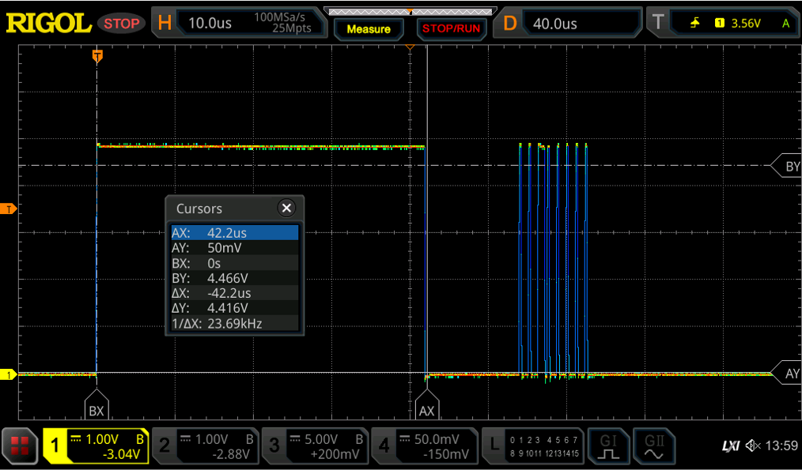
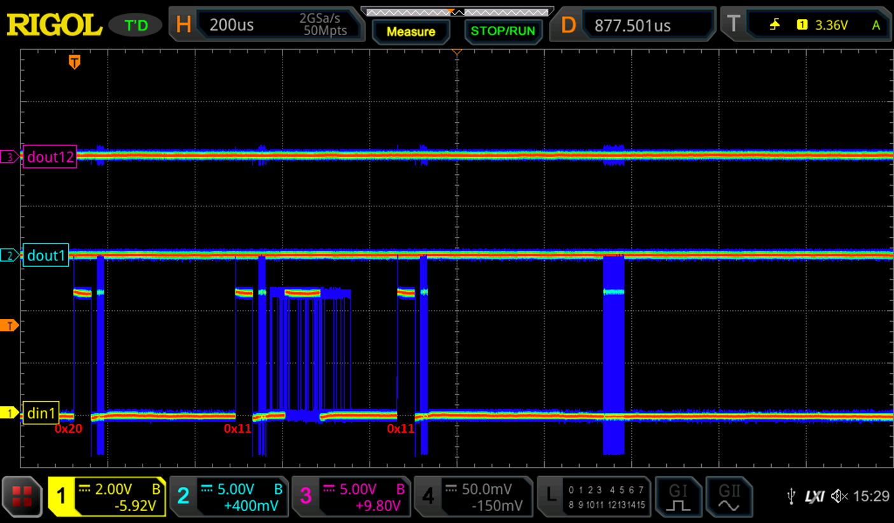

# Gen2 Addressable RGB - Protocol Analysis

V1.0 - 2024-Jan-21 

Official Repository: [https://github.com/cpldcpu/Gen2-Addressable-RGB](https://github.com/cpldcpu/Gen2-Addressable-RGB)

### Table of Contents

- [Introduction](#introduction)
	- [The companies behind Gen2 ARGB](#the-companies-behind-gen2-argb)
	- [Investigated Hardware](#investigated-hardware)
	- [Gen2 ARGB vs WS2812](#gen2-argb-vs-ws2812)
- [Description of Operating Modes and Protocol](#description-of-operating-modes-and-protocol)
	- [Standard WS2812 mode](#standard-ws2812-mode)
	- [Configuration Mode](#configuration-mode)
		- [Interpretation of 24 bit configuration word](#interpretation-of-24-bit-configuration-word)
	- [Bidirectional mode / Readout mode](#bidirectional-mode--readout-mode)
	- [Multi-Layer Mode / Y-Cable Mode](#multi-layer-mode--y-cable-mode)
		- [Substring control commands](#substring-control-commands)
		- [Substring initialization and identification](#substring-initialization-and-identification)
- [Summary and Conclusions](#summary-and-conclusions)

# Introduction

The WS2812 has been around for a decade and remains highly popular, alongside its numerous clones. Despite the WS2812 being in existence for a significant amount of time, the protocol and fundamental features of the device have only undergone minimal changes. While there have been some iterative improvements, such as introducing 4 channels, higher PWM frequency, redundant bus, or 16-bit color, the majority of the system still relies on a single wire and 8-bit RGB pixels.

What about bidirectional communication to autodetect LEDs and monitor their health? Allowing to send configuration data to the LEDs to fine tune their behavior? Or even supporting more complex topologies beyond serial strings?

Enter "Gen2 ARGB". I first learned of it in  [an issue posted to the WLED project](https://github.com/Aircoookie/WLED/issues/2675). This new controller type is an extension of the WS2812 concept, which was introduced by companies in the gaming PC space to allow for more flexible control of RGB lighting in PC cases. Major supporters of Gen2 ARGB include Coolermaster and Asus.

What is quite curious is that they do not seem to be too eager to market their improvements. Although some hardware seems to support Gen2, information about its benefits and functionality is scarce. Most search results are from forums where people are trying to understand what Gen2 is and how to use it.

Reason enough to take a closer look. This article summarizes my research on Gen2 ARGB , which includes information gathered from various sources on the web, as well as observations made through reverse engineering the protocol and analyzing the behavior of a Gen2 controller.

I will not go through all the steps I went through to analyze the protocol and discover information, as this was quite a nonlinear process spread out over the last 2 years. Instead, a condensed summary of the findings is presented below.

## The companies behind Gen2 ARGB 

The company promoting Gen2 ARGB  the most seems to be Coolermaster. Their technology promotion page is [here](https://landing.coolermaster.com/pages/addressable-gen-2-rgb-led-controller/). They sell controllers for Gen2 ARGB  LED strings and accessories, such as RGB lit coolers and light strips that can be attached to the controllers. 

It appears that the technology itself originated at two small IC design houses: Polywell and Anapex. Polywell first [announced the technology already in 2019](https://www.polywell.com.tw/index.php/2019-05-31-14-19-25/74-new-2nd-generation-addressable-rgb-led-demoed-in-computex-taipei-2019.html) and they also have a page [promoting RGB-LED driver ICs](https://www.polywell.com.tw/index.php/lighting-products/lighting-products-ic.html). The ICs themselves seem to have been developed by Anapex where you can find a [summary of their line of ARGB LED driver ICs](http://www.anapex.com.tw/en/product_4) that lists a number of intriguing features without explaining what they are.

In case you looked at the links above and were confused about how ARGB2 Gen2 is different from the WS2812 - well, I was too.  

## Investigated Hardware

Since I was not able to locate any discrete Gen2 ARGB  LEDs, let alone find data-sheets. I purchased a LED controller ([Coolermaster A1](https://www.coolermaster.com/catalog/coolers/rgb-accessories/led-controller-a1/)) and a fan with Gen2 ARGB LEDs ([Artic P12 PWM PST-ARGB](https://www.arctic.de/en/P12-PWM-PST-A-RGB/ACFAN00231A)). 

<p align="center">
	
</p>

The LED controller is a USB device that can be connected to a PC and controlled via software. Up to three Gen2 ARGB  LED strings can be connected to it. The controller contains a single custom IC, most likely a micro-controller.

<p align="center">
	
</p>

The fan contains a small PCB with 12 LEDS in 3528 form factor. These LEDs appear virtually identical to other addressable RGB LEDs on the market. I believe the controller IC in the LEDs is the AP6112Y from Anapex.

<p align="center">
	
</p>

I logged the communication on the dataline between controller and LEDs and also between individual LEDs. Then I recreated the derived control sequences on an AVR controller for verification. Some features had to be identified by fuzzing (e.g. LED configuration settings.). No software reverse engineering was involved.

In the meantime, LCSC has also started selling an LED called [SK6112-RG](https://www.lcsc.com/product-detail/Light-Emitting-Diodes-LED_OPSCO-Optoelectronics-SK6112-RG_C5440833.html) which seems to be based on the AP6112 controller. This does not support the Y-cable mode, but the other GEN2 extension.

## Gen2 ARGB vs WS2812 

ARGB2 GEN2 is an extension of the WS2812 protocol and fully compatible to it. If an ARGB2 GEN2 led is driven by a WS2812 controller, it will behave like a WS2812. However, there are some additional features, as shown below.



- **Configuration:** A special mode allows writing configuration data to the LEDs, which allows to change PWM frequency, driving current, and other parameters.
- **Bidirectional communication:** Enables automatic detection of the number of LEDs on the bus and allows reading information from the LEDs.
- **Y-Cable mode aka "Multi-Layer Mode":** Allows to connect multiple LEDs strings in parallel to the controller using a single wire. There are mechanisms to detect individual strings, uniquely identify them, and control them independently. 

While the first two items are somewhat logical extension of the WS2812 protocol, the Y-Cable is the most curious feature. It allows for easy connection of multiple Gen2 ARGB  devices to a single controller port. 

To implement these additional functionality, the WS2812 protocol is extended in the Gen2 ARGB  devices. This is not supported in typical WS2812 controllers and may require software and potentially even hardware changes to support it.

# Description of Operating Modes and Protocol

## Standard WS2812 mode

When sending RGB data in the WS2812 protocol to these LEDs, they behave like WS2812 LEDs. Impulses shorter than 350 ns are interpreted as a zero, impulses longer than 450 ns are interpreted as a one. The total cycle time of a bit is 1.25µs. Reset timing is >100µs. Data order is GRB, 8 bit per channel. In other words, these LEDs are fully compatible with WS2812 LEDs.

Since the WS2812 protocol does not allows to transmit additional commands, the Gen2 ARGB  designers had to find a way to "escape" from the defined code sequence. The only way of doing this is to use signal timings that are outside of the WS2812 specification. In this case they use combinations of long pulses to indicate special commands.

## Configuration Mode 

The configuration mode allows to write information to a configuration register within each LED to change its behavior. The mode is initiated by sending a 20 $\pm$ 5 µs long "Hi" pulse directly after a reset (bus was low for >100 µs).

The oscilloscope image below shows a series of pulses of different length being sent to a chain of LEDs. Pulses between 15µs and 25µs are forwarded within the LED chain and are re-timed to 20µs. _dout1_ corresponds to the output of the first LED in the chain, _dout12_ to the output of the 12th LED.

<p align="center">
	
</p>

After sending the start pulse the LEDs are in "configuration" mode. The controller waits for ~300µs and then sends a series of 24 bit words in the WS2812 protocol to the LEDs. Instead of interpreting these as RGB values, they are stored in a 24bit internal configuration register. After the the configuration data has been sent, the LEDs will automatically turn to "normal" mode after the next reset.

### Interpretation of 24 bit configuration word

Based on fuzzing, the following interpretation of the 24 bit configuration word has been derived:

<p align="center">
	
</p>

Each LED in a string can be configured individually. The function of the bits is as follows:

**PWM Frequency**: These two bits allow selecting the PWM frequency in accordance to the table below. Higher frequency cause less flicker, but may lead to more EMI and a higher error in brightness.

<p align="center">
    
</p>

**ID**: If this bit is set to "1" the device will return a one bit ID in the bidirectional communication mode (see next section) this is apparently used to identify strings. The ID for each LED seems to be chosen at random at manufacture time. If ID bit is set to "0" (default), the length of the response pulse indicates the drive current setting. Assumption: LO=5mA, MID=12mA, HI=20mA

**Current Fine Tuning**: A five bit value that can be used to modify the driving current of each R,G,B channel. Values higher than 0 lead to a linear increase of driving current. The maximum setting of 31 corresponds roughly to a doubling of the driving current. This feature can be used to correct for variation of the used LED chips to achieve a consistent white color.

**Drive1-Drive3**: If all of these bits are set to "1", the driving current of all channels is roughly halved, which indicated that these bits control the overall driving current. If all bits are set to "1", the response pulse length also changes from "MID" to "LO". All other combinations have no effect. It is not quite clear why three bits are required to select just one option. Possibly other driving current settings can be chosen with these bits, but have been disabled in this particular LED to avoid damage.

**Unknown Bits**: Bits of unknown purpose. No change was observed when modifying these bits.

Below you can find example code that can be used to send configuration data to Gen2 ARGB  LEDs. The code is based on the light ws librariy on an ATMega328p and uses PB0 for communication.

```c
void ARGB2_initconfigsend(void) {

    uint8_t out1=PORTB|1;
    uint8_t out0=PORTB&~1;
    uint8_t outon =DDRB|1;
    uint8_t outoff=DDRB&~1;

    PORTB=out1;						
    _delay_us(20);
    PORTB=out0;
    _delay_us(300);
}

void ARGB2_sendconfig(uint8_t *configword,uint8_t numberofleds) {
	
	ARGB2_initconfigsend();
	
	for (uint8_t i=0; i<numberofleds; i++) {
		ws2812_sendarray(configword,3);		
	}
		_delay_us(300);
}
```
## Bidirectional mode / Readout mode

This mode allows reading information from the LEDs. The protocol is rather limited and only one or 1.5 bits can be transferred, which are encoded by the length of a pulse.

This function is used to identify the number of LEDs in a string and also allows reading a unique ID of individual strings in a Y-cable configuration but reading out the ID bit of each LEDs and concatenating them.

An oscilloscope screenshot of the readout timing is shown below.

<p align="center">
	
</p>

The readout mode is initiated by the following sequence:
1. 20µs "Hi"
2. 10µs "Lo"
3. 50µs "Hi"
4. Set bus to "Hi-Z" (input mode), 5µs wait

The first LED will then send this sequence to the second LED2 in the chain on DOUT. Simultaneously, DIN will will actively drive the pin after 5µs and send out a single pulse as a response. After completion of the data transmission, LED1 will relay data from LED2 to the MCU. After then bus was idle for >100µs, all LEDs will reset to normal behavior.

The response can be one of three different sequences

<div align="center">

|       | "Lo" | "Hi" | "Lo" | Wait |
|:-----:|:----:|:----:|:----:|:---:|
| Short | 15µs | 10µs | 50µs | 5µs |
| Medium| 15µs | 20µs | 40µs | 5µs |
| Long  | 15µs | 40µs | 20µs | 5µs |
</div>

In default mode, the length of the pulse indicated the LED driving strength setting. The encoding is apparently Short= 5mA, Medium=12mA, Long=20mA.

When the "ID" bit in the configuration words is set to "1", the LEDs will return a single bit in the readout mode, which is encoded as "short" or "long" pulse. The value of the bit seems to be assigned to the LED at manufacture time.

```c
uint8_t ARGB2_readoutstring(void) {

	uint8_t out1=PORTB|1;
	uint8_t out0=PORTB&~1;
	uint8_t outon =DDRB|1;
	uint8_t outoff=DDRB&~1;

	PORTB=out1;		// Initiate readout
	_delay_us(20);
	PORTB=out0;
	_delay_us(10);
	PORTB=out1;
	_delay_us(50);
	PORTB=out0;
	DDRB=outoff;
	_delay_us(80);   // implement code to read pulse here
	DDRB=outon;
}
```

## Multi-Layer Mode / Y-Cable Mode

The Y-cable mode is the most curious and most complex extension. It allows controlling multiple LED strings in parallel using a single wire. The controller can address individual strings and control them independently.

<p align="center">
    
</p>

In this mode, the first LED in each string (red border) takes over a special role as a gateway controller that decides whether data is accepted to the string or not. 

In a first step, each substring is identified and a unique address is assigned. 

Subsequently, a special command can be used to activate one or all of the substrings. Data sent by the MCU in the WS2812 protocol is then only accepted by the specified string(s). Similarly, also only specific substrings can be read out in bidirectional mode or configured in the configuration mode.

### Substring control commands

Yet another control sequence is used to send commands to the substrings. One example is shown in the oscilloscope image below:

<p align="center">
	
</p>

Each substring command consists of the following sequence:

1. 40µs "Hi"
2. 12µs "Lo"
3. Eight bits (the command) transmitted in the WS2812 protocol, MSB first.

The following table provides an overview of the commands used in Y-Cable mode. The commands names were assigned by me and may be different from the official documentation, which is not accessible to me. The commands are represented in hexadecimal format, where X is a 4-bit field (bits 0-3) used for addressing and the first four bits encode the command type.

| Command | Description |
|---------|-------------|
| 1Xh | **Initialize Address** - Initializes a string with the given address. |
| 2Xh | **Reset** - Resets the address of one or all strings. |
| 3Xh | **Ping** - Test for presence of an initialized string. |
| 4Xh | **Activate** - Activate a specific string. |

#### Command Details

- **Initialize Address (0x1X)**: 0x11-0x1F initialize one randomly chosen string to the respective address 0x01-0x0f. The bus must be left floating on „0“ directly after command for collision detection. A response from the string is indicated by a 60µs „hi“ pulse that is randomly shifted from 10µs to 60µs after the falling edge of the command. 0x10 also elicits a response, but the string can be initialized again with 0x11-0x1f after that.
- **Reset (0x2X)**: 0x20 resets all string addresses. 0x21-2F resets only individual string address.
- **Ping (0x3X)**: 0x31-0x3F ping for an initialized string. The respective string will respond with a high pulse when it was initialized with 0x1X before. 0x30 leads to a response after initialization with 0x10.
- **Activate (0x4X)**: 0x41-0x4F precede a data update for the respective substring. The payload for the substring directly follows and is valid until the next command is sent.

In these commands, X represents the address of the sub-string. 1-F are 15 possible substrings, 0 seems to be a broadcast address that addresses all substrings at the same time regardless of their address.

```c
void ARGB2_sendcommand(uint8_t cmd) {
	
		uint8_t out1=PORTB|1;
		uint8_t out0=PORTB&~1;
	
		PORTB=out1;
		_delay_us(40);
		PORTB=out0;
		_delay_us(12);

		command[0]=cmd;
		ws2812_sendarray(command,1);
}

uint8_t ARGB2_receivecommandresponse(void) {

		uint8_t out1=PORTB|1;
		uint8_t out0=PORTB&~1;
		uint8_t outon =DDRB|1;
		uint8_t outoff=DDRB&~1;

		DDRB=outoff;
		PORTB=out0;
		_delay_us(300);  // implement code to read pulse here
		DDRB=outon;
		
		return 0;	
}
```

### Substring initialization and identification

Initially all substrings are in an uninitialized state and receive exactly the same data from the MCU at their input. How can we control them individually and, even more curious, how can they be identified?

#### Arbitration procedure

The first phase of the initialization is to assign addresses to each substring. A special arbitration procedure is used for that with the following sequence.

1. Send command 0x20 to reset the addresses of all substrings.
2. Send command 0x11 to assign address 0x01 to one substring. 
3. After sending the command, pull the dataoutput low and put in it Hi-Z state.
4. Wait if a high pulse is received from a substring, confirming the address assignment.

When an uninitialized substring receives the command 0x11, it will wait for a random time between 10 µs and 60 µs, test whether the input is still low. If the input is still low, it means that no other substring has claimed address 0x01. It will then pull high Din for 60µs, and store the address 0x01 internally. 

<p align='center'>

</p>

The oscilloscope image above shows the timing of the sequence with several measurements stacked to indicate the randomness of the response. Note that the string does not react to the second command because it already had an address assigned (It will also not respond to other address assignment commands). Also note, that the commands are not forwarded to the second device in the string. Only the "gateway device" takes part in the address assignment procedure.

The successful address assignment can be verified with the ping command 0x31. The string will respond with a 60µs long high pulse if it has been initialized with 0x11 before. 

5. Send command 0x31 to verify assignment of address 0x01.
6. Send command 0x41 to activate the string with address 0x01.
7. Commence with identification (see below)

After this sequence has been completed and the string was activated, we can send or receive data from the substring with the designed address 0x01.

This procedure has to be repeated with increasing address numbers until each substring in the system has been assigned a unique address.

#### Substring identification

One question remains: How do we identify each substring after we assigned addresses? To do that, we have to read out the ID bit of each LED in the substring. Concatenating the ID bits of all LEDs in the substring will give us a unique ID.

This can be done with the following sequence

1. Send configuration word 0x002000 to all LEDs in the substring to activate ID readout.
2. Use the readout mode to read the LED-ID bits from each LED and count the number of LEDs
3. Concatenate the LED-ID bits of all LEDs to get the Substring-ID.

It appears that the LED-ID bits are assigned randomly at manufacture time to the LEDs. The length of the substring-ID depends on the number of LED used in each device. In case of the fan I investigated, 12 LEDs are used. Therefore the substringID is 12 bits long, allowing for 4096 unique combinations. 

This does not appear to be a very large number and there is a residual probability (0.00024) that, for example, two RGB fans with the same ID are installed in the same system. In that case, the substring assignment may switch randomly between the two fans whenever the system is powered on. Either this is deemed an acceptable risk, or I have overlooked additional mechanisms.

# Summary and Conclusions

The Gen2 ARGB protocol represents a notable improvement over the vanilla WS2812 protocol, introducing features such as bidirectional communication, configuration mode, and Y-Cable mode. These enhancements significantly expand the capabilities of the classic WS2812 protocol, addressing some of its inherent limitations. 

However, the Gen2 ARGB  extensions to the WS2812 protocol are also quite purpose defined and do not offer hooks for additional features. For example, adding more configuration options would require an additional protocol extension.

It seems that Gen2 ARGB  does not yet have caught on outside of products for enthusiast PC builders. However, the availability of the SK6112 LEDs provides access to at least some of the features in discrete LEDs. 
 
In combination with the proprietary nature of this protocol, it seems uncertain if Gen2 ARGB will become a widely adopted standard outside of its niche. 

I hope this protocol analysis is useful. Be aware that it is not based on official documentation. Use the information provided here at your own risk.

If you have additional remarks, please let me know (or even submit a pull request to this article). Of course, it would also be great if more official documentation became available.